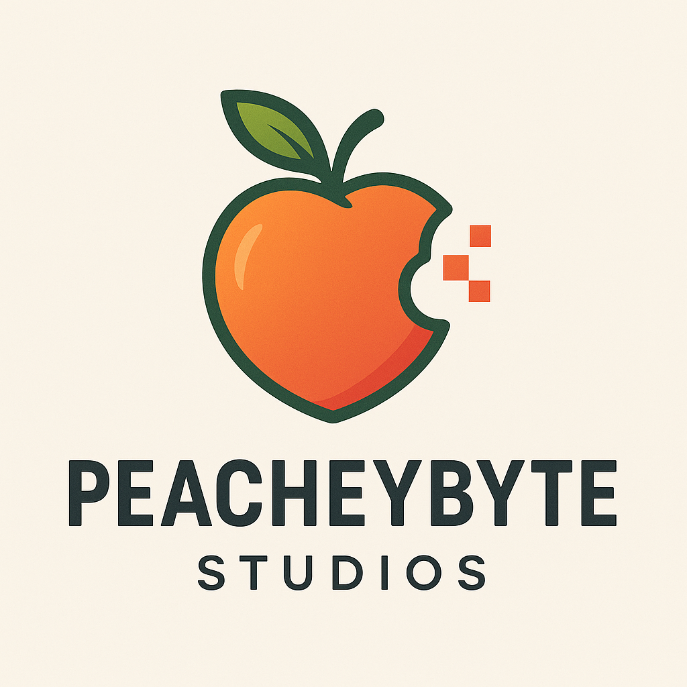

{: style="max-width: 250px; width: 100%; display: block; margin: 0 auto 2rem auto; border-radius: 12px;"}

Welcome to **Peacheybyte Studios**. We focus on building simple, reliable, and functional software solutions designed around data privacy, practical utility, and everyday productivity.

Whether you need lightweight offline utility, personal collection management, or scalable multi-user asset and maintenance tracking, our applications are built to stay fast, dependable, and easy to use without the fluff.

<h3 style="text-align: center; margin-bottom: 1.5rem;">Explore our current lineup below:</h3>

---

### The Collection Curator

Manage personal collections locally by location, price, and tags without requiring cloud syncing or complex setups.

  <a href="https://peacheybyte.github.io/collection-curator/" class="btn" style="background-color: #007bff; color: white; padding: 8px 16px; border-radius: 20px; text-decoration: none; display: inline-block;">Explore Collection Curator</a>

---

### The Asset Curator

An advanced asset management solution featuring QR code scanning, maintenance tracking, and multi-user database sharing.

  <a href="https://peacheybyte.github.io/asset-curator/" class="btn" style="background-color: #007bff; color: white; padding: 8px 16px; border-radius: 20px; text-decoration: none; display: inline-block;">Explore Asset Curator</a>

---

### EhWot

A simple, lightweight text translator app built for quick and direct translations.

  <a href="https://peacheybyte.github.io/ehwot/" class="btn" style="background-color: #007bff; color: white; padding: 8px 16px; border-radius: 20px; text-decoration: none; display: inline-block;">Explore EhWot</a>

